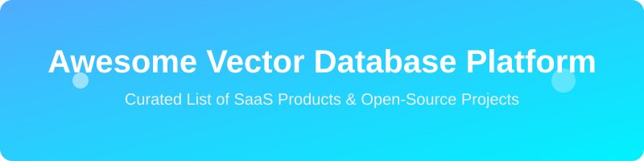

<h1 align="center">🚀 Awesome Vector Database Platform 🚀</h1>

  

  
  
  

  <em>A highly curated and SEO-friendly list of SaaS products and open-source GitHub projects focused on Vector Similarity Search, Embeddings Storage, RAG, and AI Retrieval Infrastructure.</em>

## 🌟 Top Vector Database Platforms Ecosystem

**Curated List of SaaS Products & Open-Source GitHub Projects**  

*Focused on Vector Similarity Search, Embeddings Storage, RAG, Semantic Search & AI Retrieval Infrastructure*  

**Last updated: August 2026**

This repository tracks notable **SaaS platforms** and **open-source projects** for **Vector Databases**. These tools store, index, and query high-dimensional vector embeddings for semantic search, retrieval-augmented generation (RAG), recommendation systems, and other AI applications requiring fast approximate nearest-neighbor search.

**Examples** include Pinecone, Weaviate, Qdrant, Milvus, Chroma, LanceDB, Vespa, Redis Vector, Elastic Vector Search, Astra DB, Zilliz Cloud, Astra DB Vector, and pgvector Cloud (the category leaders).

**Open-source emphasis**: This section is heavily expanded with every major active project for vector search engines, embedding stores, and related libraries — ideal for AI engineers, RAG developers, and teams seeking high-performance, self-hosted, or fully controllable vector infrastructure without vendor lock-in.

Contributions welcome! Open a PR to add/update entries. Keep descriptions factual and link to official sites.

## 📑 Table of Contents

- [SaaS/Hosted Platforms](#saas-hosted-platforms)

- [Open-Source GitHub Projects](#open-source-github-projects)

- [How to Contribute](#how-to-contribute)

- [Disclaimer](#disclaimer)

## ☁️ SaaS/Hosted Platforms

| Platform | Description | Pricing | Free Tier Limit | Company Size (Valuation) |
|----------|-------------|---------|-----------------|--------------------------|
| **[pgvector Cloud offerings](https://github.com/pgvector/pgvector)** | Managed PostgreSQL services (from various cloud providers) that include the pgvector extension for vector similarity search inside Postgres. | Varies by provider (e.g., Supabase Pro $25/mo) | Varies (e.g., Supabase Free: 500 MB storage, 2 projects) | $10.5B (Supabase) |
| **[Elastic Cloud (Vector Search)](https://www.elastic.co/)** | Managed Elasticsearch/OpenSearch with dense vector (kNN) support for hybrid full-text + semantic search. | Starts at ~$99/month (Standard) | 14-day free trial only (No permanent free tier) | $7.15B |
| **[Redis Cloud (Vector Search)](https://redis.io/)** | Managed Redis with vector similarity search (RediSearch / VSS) for ultra-low-latency retrieval combined with caching and operational data. | Usage-based Essentials plans | 30 MB memory, 100 ops/sec, 30 concurrent connections | $2.0B |
| **[Astra DB / Astra DB Vector (DataStax)](https://www.datastax.com/products/datastax-astra)** | Serverless database built on Apache Cassandra with native vector search capabilities for generative AI workloads. | Serverless usage-based | Up to 5 serverless databases with monthly credit allocation | $1.6B |
| **[Pinecone](https://www.pinecone.io/)** | Fully managed, serverless vector database optimized for low-latency similarity search, hybrid retrieval, and production RAG workloads with minimal operational overhead. | Serverless usage-based or from $70/mo (Standard) | 2 GB storage, 5 indexes, 2M writes / 1M reads per month | $750M |
| **[Zilliz Cloud (Milvus)](https://zilliz.com/)** | Fully managed cloud service for Milvus, designed for billion-scale vector search with distributed architecture and enterprise features. | Serverless usage-based or Dedicated | 1 free cluster, 5 GB storage, 2.5M vCUs/month, 2 collections | $600M (Est.) |
| **[Weaviate Cloud](https://weaviate.io/)** | Managed cloud offering of the open-source Weaviate vector database, supporting hybrid search, GraphQL, and modular embedding pipelines. | Usage-based (Flex/Plus plans) | 1 free cluster, 100K objects, 1 GB memory, 10 GB disk | $200M |
| **[Qdrant Cloud](https://qdrant.tech/)** | Managed service for the high-performance Qdrant vector database, emphasizing fast filtering, low latency, and easy scaling. | Usage-based | 1 free cluster, 0.5 vCPU, 1GB RAM, 4GB disk (approx 1M vectors) | $200M |
| **[Chroma Cloud](https://www.trychroma.com/)** | Hosted version of the popular open-source Chroma embedding database, geared toward rapid prototyping and production RAG applications. | Usage-based ($2.50/GiB write, $0.33/GiB storage) | $5 initial free credits (No permanent free tier) | $75M |
| **[LanceDB Cloud](https://lancedb.com/)** | Managed offering of the LanceDB multimodal vector database built on the Lance columnar format. | Usage-based | $100 initial free credits (No permanent free tier) | Undisclosed |
| **[Vespa Cloud](https://cloud.vespa.ai/)** | Managed platform for Vespa, a large-scale search and recommendation engine with native vector and hybrid ranking capabilities. | Usage-based | 14-day free trial with $300 credits (No permanent free tier) | $18.8M (Est.) |

## 📖 Open-Source GitHub Projects

- **[Meilisearch](https://github.com/meilisearch/meilisearch)** 

  A lightning-fast search engine that fits effortlessly into your apps, websites, and workflow.

- **[Milvus](https://github.com/milvus-io/milvus)** 

  Leading open-source, cloud-native vector database designed for billion-scale similarity search, with distributed architecture, multiple index types, and strong ecosystem support (LF AI & Data project).

- **[Faiss (Facebook AI Similarity Search)](https://github.com/facebookresearch/faiss)** 

  Foundational open-source library for efficient similarity search and clustering of dense vectors, widely used as a building block in other systems.

- **[Qdrant](https://github.com/qdrant/qdrant)** 

  High-performance open-source vector database written in Rust, known for excellent filtering, low latency, and production-ready features for RAG and semantic search.

- **[Chroma](https://github.com/chroma-core/chroma)** 

  Popular open-source embedding database designed for simplicity, developer experience, and rapid development of LLM/RAG applications.

- **[Typesense](https://github.com/typesense/typesense)** 

  Fast, typo tolerant, open source search engine.

- **[pgvector](https://github.com/pgvector/pgvector)** 

  Open-source PostgreSQL extension that adds vector similarity search (HNSW, IVFFlat) directly inside Postgres, ideal for teams already using relational databases.

- **[Weaviate](https://github.com/weaviate/weaviate)** 

  Open-source vector database with native hybrid search (BM25 + vector), GraphQL API, modular vectorization, and flexible deployment options.

- **[Annoy / Hnswlib / other ANN libraries](https://github.com/spotify/annoy)** 

  Lightweight open-source approximate nearest neighbor libraries frequently used for custom vector search implementations.

- **[Txtai](https://github.com/neuml/txtai)** 

  Open-source embeddings database and semantic search framework for building AI-powered applications.

- **[LanceDB](https://github.com/lancedb/lancedb)** 

  Open-source, developer-friendly vector database built on the Lance columnar format, optimized for multimodal data and large-scale analytics.

- **[Vespa](https://github.com/vespa-engine/vespa)** 

  Open-source big data serving engine with powerful vector search, hybrid ranking, and real-time computation capabilities at massive scale.

- **[Hnswlib](https://github.com/nmslib/hnswlib)** 

  Header-only C++ HNSW implementation with Python bindings.

- **[Marqo](https://github.com/marqo-ai/marqo)** 

  Open-source tensor search engine that simplifies multimodal and hybrid search with built-in vectorization.

- **[USearch](https://github.com/unum-cloud/usearch)** 

  Smaller & Faster Single-File Vector Search Engine.

- **[Vald](https://github.com/vdaas/vald)** 

  Kubernetes-native distributed vector search engine focused on high scalability and cloud-native operations.

### Additional Strong Open-Source Options

- **Database extensions**: pgvector, pgvectorscale, Redis Stack / RediSearch, Elasticsearch/OpenSearch kNN, ClickHouse vector functions, DuckDB vector support.

- **Embedded & lightweight**: Chroma, LanceDB, and similar tools ideal for local development and single-node deployments.

- **Distributed & cloud-native**: Milvus, Qdrant, Weaviate, Vald, and Vespa for production-scale workloads.

- **Libraries**: Faiss, Hnswlib, ScaNN, and other high-performance ANN implementations.

- Many research and specialized **vector indexing** projects continuing to advance the state of the art on GitHub.

**Frameworks for building custom systems**: Combine **Milvus, Qdrant, or Weaviate** as the core vector store, **pgvector** when staying inside PostgreSQL, embedding models (open-source or API), and orchestration frameworks (LangChain, LlamaIndex, Haystack) to create complete open-source RAG and semantic search pipelines.

## 🤝 How to Contribute

1. Fork the repo.

2. Add/edit entries in `README.md` (follow existing format).

3. Include: name, link, 1–2 sentence description, and whether it's SaaS or open-source.

4. Submit PR with a short explanation.

Star the repo if you find it useful!

## ⚠️ Disclaimer

- This is a **community-curated** list — not exhaustive and not an endorsement.

- Vector databases often store sensitive embeddings derived from proprietary or personal data; proper access controls, encryption, and compliance measures are essential.

- Self-hosted open-source solutions require attention to indexing performance, memory/disk management, and backup strategies at scale.

---

**Made for AI engineers, RAG developers, search teams, and infrastructure builders.**  

Let's make vector search more open, performant, and accessible.

## 📈 Star History

<a href="https://www.star-history.com/?repos=ishandutta2007%2FAwesome-Vector-Database-Platform&type=date&legend=bottom-right">
<picture>
<source media="(prefers-color-scheme: dark)" srcset="https://api.star-history.com/chart?repos=ishandutta2007/Awesome-Vector-Database-Platform&type=date&theme=dark&legend=bottom-right" />
<source media="(prefers-color-scheme: light)" srcset="https://api.star-history.com/chart?repos=ishandutta2007/Awesome-Vector-Database-Platform&type=date&legend=bottom-right" />

</picture>
</a>

